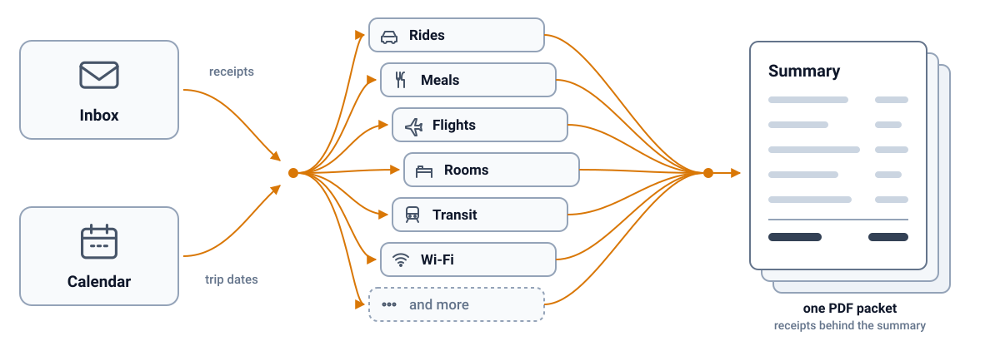

<h1 align="center">🪃 boomerang</h1>

  <b>Your money went out. Bring it back.</b>
   
  Turn your inbox into a reimbursement claim.

  
  
  
  
  
  

  Runs on
   
  
  
  
  
  
  

  <b><a href="examples/packet.pdf">See the example packet (PDF)</a></b>

You spent your own money on someone else's behalf. An onsite interview, a client trip, a contract gig. Now the receipts are scattered across your personal inbox. You already spent the time. Getting the money back should not cost you more of it.

Boomerang builds it. Every receipt, the right total, one PDF.

## Features

| Feature | What it means |
| --- | --- |
| **Finds everything** | The whole trip window, late receipts, folios sent as attachments |
| **Splits who paid** | Company card from yours, eTicket chains, credits in and points out |
| **Multi-company trips** | Two onsites in one trip, the shared flight and nights split |
| **Real receipts** | The vendor's own email, amounts untouched, one per page |
| **One PDF** | Summary page first, every receipt behind it |
| **Multi-currency** | Claims the posted home amount, notes the local one |
| **Change fees and cancellations** | The fee you ate and the trip that never happened, both labelled |
| **Personal days** | Your own days come out, the four airport legs stay in |
| **Stipends** | Counted by days worked, shown as their own rows above the total |

Full ruleset in [`policy.md`](policy.md).

## How it works

  

Two search passes, then cleaning, who paid and folio text in parallel, then the model's judgment, then one packet.

## Quick start

1. `npx skills add oficiallyAkshay/boomerang`, which installs the skill into
   Claude Code, Cursor, Codex and about seventy other agents. By hand instead:
   clone this repo and copy the folder into `~/.claude/skills/boomerang/`. On
   Claude.ai and Cowork there is no clone: zip the skill folder and upload it
   under Customize, Skills, as [`references/hosts.md`](references/hosts.md)
   sets out.

2. `pip install -r requirements.txt`, or `uv sync`. No browser download is
   needed when Chrome or Edge is already on the machine.

3. Ask your agent: "Build my reimbursement packet for the trip on June 11."

`python scripts/doctor.py` prints what is present, what is missing, and the one
command that fixes each thing.

## Configuration and security

| Setting | Where | Default |
| --- | --- | --- |
| The shared ruleset | [`policy.md`](policy.md) | Ships with the skill, yours to edit |
| Your own overrides | `policy.local.md`, ignored by git ([template](references/policy.local.example.md)) | Tips out, ride extras in, alcohol flagged, upgrades out, seat fees in, 60 minute meal window, USD |
| Browser for the PDF | `BOOMERANG_BROWSER` | Chrome, then Edge, then Chromium, first one found |
| Gmail fallback | `BOOMERANG_GMAIL_CLIENT_SECRET` | Off, the host's own email tool is used |

### What leaves your machine: nothing

| Concern | What actually happens | The guard |
| --- | --- | --- |
| Reading your mail | Read only, never a write and never a delete | The Gmail fallback asks for the read-only scope |
| Where the token sits | In your home config folder, readable by you alone | Mode 600 inside a 700 directory |
| Sending data anywhere | No uploads, no telemetry, no analytics | Only your mail provider, plus vendor images when you ask |
| The packet phoning home | Nothing loads when a reviewer opens it | A content security policy in the packet, scripts off at render |
| Vendor tracking | Pixels and tracking links are gone before the build | Beacon images dropped, links unwrapped to their own text |
| A vendor email running code | Nothing inside a receipt can act | Scripts, handlers, iframes and style imports removed first |
| Dependencies | Two runtime packages, pinned to exact versions | Audited against the advisory database on every run of CI |
| This repo leaking data | Every sample and example is synthetic | A hashed denylist gate runs on each commit and in CI |

Receipts, the packet and the PDF are files on your disk; you send the claim yourself.

### How usage is counted

The clone badge is GitHub's own rolling 14 day traffic window for this
repository, read once on every push to `main` and written to the `badges` branch
as a small JSON file. Nothing is collected from anyone's machine: GitHub counts
a clone at its own end, the figures are repository totals with no identity
attached, and boomerang still sends nothing anywhere.

Until the owner adds the `TRAFFIC_TOKEN` secret and the repository is public the
badge reads "resource not found", because shields cannot fetch a raw file from a
private repository.

## Common workflows

| Situation | What you say | What comes back |
| --- | --- | --- |
| They booked the flight and hotel | "Build my packet for the Redwood onsite on June 11." | Rides, meals and Wi-Fi claimed, their flight and room dropped |
| You paid in full, with a stipend | "Client trip June 3 to 6, stipend 75 a day." | Flight, hotel and rides claimed, four stipend days above the total |
| Two companies in one city | "Redwood on Tuesday, Foxglove on Thursday, same trip." | Two packets, the shared flight and nights split evenly |
| Personal days added | "I stayed through the weekend for myself." | Weekend nights and rides out, all four airport legs kept |
| The onsite was cancelled | "Redwood cancelled June 11 after I had booked." | Change fee and the non-refundable night in, labelled for the reviewer |
| A trip abroad | "Berlin onsite, everything was charged in euros." | Posted dollar amounts claimed, each line noting the euro total |
| The sweep before you send | "Anything new since we built it?" | Late rides added, totals restated, the PDF rebuilt |

## How it compares

| | Corporate expense tools | Receipt scanner apps | Asking a chat model | Boomerang |
| --- | --- | --- | --- | --- |
| Needs a company account | Yes | No | No | No |
| Finds receipts for you | From the card feed | You forward each one | You paste each one | Searches your mailbox |
| Knows who paid | From the card feed | No | Only if you say so | Card fingerprint, in code |
| Money math in code | Yes | Yes | No, the model adds up | Yes |
| Real vendor receipts in the output | Photos you upload | Photos you upload | None | The vendor's own email |
| Follows a written policy you can edit | An admin sets it | No | Only what you retype | Yes, a file you own |
