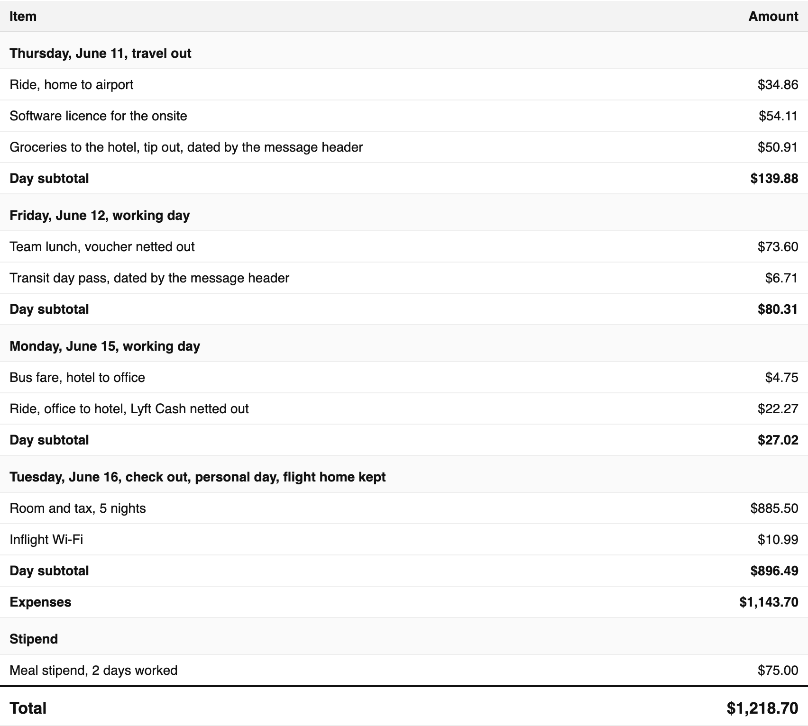
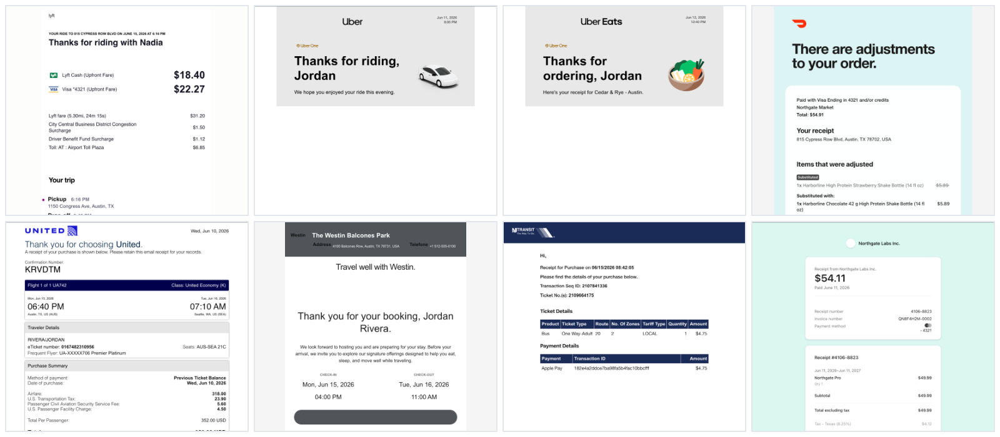

<h1 align="center">🪃 boomerang</h1>

  <b>Your money went out. Bring it back.</b>
   
  Turn your inbox into a reimbursement claim.

  
  
  
  

  Runs on
   
  
  
  
  
  
  

You spent your own money on someone else's behalf. An onsite interview, a client trip, a contract gig. Now the receipts are scattered across your personal inbox and a company is waiting on a claim you haven't had time to build.

Boomerang builds it. Every receipt, the right total, one PDF.

| Summary page | Vendor receipts |
| --- | --- |
|  |  |

  The first page and the receipts from the synthetic example in <a href="examples/packet.pdf"><code>examples/packet.pdf</code></a>.

## What you get

- **Every receipt, found.** Rides that landed in your inbox a day late, airport Wi-Fi, the scooter to the office, the resort fee at checkout. Boomerang searches your whole trip window so nothing gets missed
- **The right split.** Some things they paid, some things you paid. Boomerang spots the company card, drops the flight and room they covered, and claims the rest
- **Real receipts, one per page.** Rendered from the vendor's own email, amounts untouched. Lyft looks like Lyft, United looks like United. Nobody has to ask what a line means
- **One PDF, one table, one number.** Days, subtotals, total. Send it and move on

## What it covers

- Flights, and who paid for them
- Hotels, resort fees, and desk charges
- Rides, scooters, transit, tolls, parking
- Meals on travel and working days
- Change fees and cancelled trips
- Personal days added to the trip
- Stipends and per diems
- Foreign currency

Full ruleset in [`policy.md`](policy.md).

## How it works

  

Code does the mechanical work (search, fetch, clean, who paid, totals, render); the model supplies judgment (the trip, the policy, the candidate list, the one question). Cleaning, card fingerprinting and folio text run at the same time over the receipts on disk. The diagram is rendered once from [`assets/diagram/architecture.archify.json`](assets/diagram/architecture.archify.json) with Archify and committed; nothing here depends on it.

## Quick start

1. `npx skills add oficiallyAkshay/boomerang`, which installs the skill into
   Claude Code, Cursor, Codex and about seventy other agents. By hand instead:
   clone this repo and copy the folder into `~/.claude/skills/boomerang/`. On
   Claude.ai and Cowork there is no clone: zip the skill folder and upload it
   under Customize, Skills, as [`references/hosts.md`](references/hosts.md)
   sets out.

2. `pip install -r requirements.txt`, or `uv sync`. No browser download is
   needed when Chrome or Edge is already on the machine.

3. Ask your agent: "Build my reimbursement packet for the trip on June 11."

`python scripts/doctor.py` prints what is present, what is missing, and the one
command that fixes each thing.

## What you need

- Your email connected
- Your calendar connected (optional, helps find the dates)

## Where it runs

Claude desktop app, Claude.ai, Claude Code, Cowork, Codex, OpenClaw, Hermes. Anywhere that reads a skill folder.

What each host can and cannot run is in [`references/hosts.md`](references/hosts.md).

## Example

[`examples/packet.pdf`](examples/packet.pdf) is a finished packet, and
[`examples/packet.html`](examples/packet.html) is the page it was printed from.
Every name, address, card and amount in it is synthetic.

## Contributing

Bug reports, vendor samples and fixes are welcome, and
[`.github/CONTRIBUTING.md`](.github/CONTRIBUTING.md) says what the project takes
and how to run the checks first.

## License

MIT
